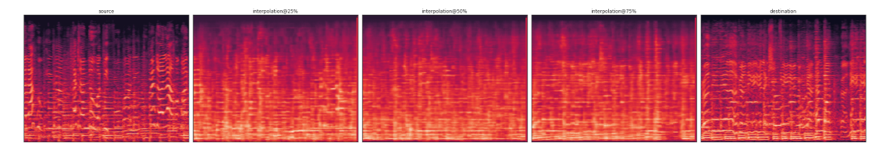
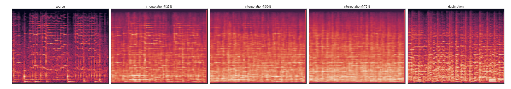
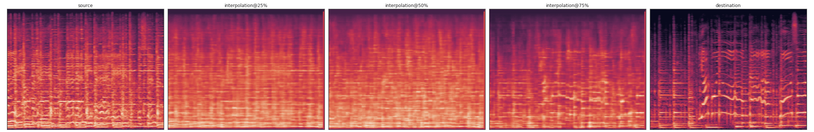
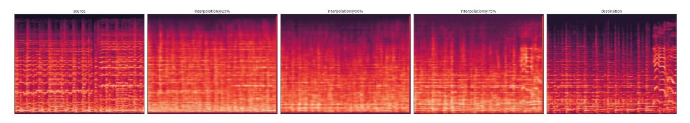

# Results for interpolation between two 5 Sec audio.

## Reconstruction results produced by using CNN as encoder

## Interpolation results produced by using CNN as encoder

Example A:

Source audio:
<a href="1/src.wav">play</a>

Source 75% + Destination 25 %:
<a href="1/25.wav">play</a>

Source 50% + Destination 50%
<a href="1/50.wav">play</a>

Source 25 + Destination 75%
<a href="1/75.wav">play</a>

Destination audio:
<a href="1/dest.wav">play</a>

Interpolation Image:

Example B:

Source audio:
<a href="2/src.wav">play</a>

Source 75% + Destination 25 %:
<a href="2/25.wav">play</a>

Source 50% + Destination 50%
<a href="2/50.wav">play</a>

Source 25 + Destination 75%
<a href="2/75.wav">play</a>

Destination audio:
<a href="2/dest.wav">play</a>

Interpolation Image:

Example C:

Source audio:
<a href="3/src.wav">play</a>

Source 75% + Destination 25 %:
<a href="3/25.wav">play</a>

Source 50% + Destination 50%
<a href="3/50.wav">play</a>

Source 25 + Destination 75%
<a href="3/75.wav">play</a>

Destination audio:
<a href="3/dest.wav">play</a>

Interpolation Image:

Example D:

Source audio:
<a href="4/src.wav">play</a>

Source 75% + Destination 25 %:
<a href="4/25.wav">play</a>

Source 50% + Destination 50%
<a href="4/50.wav">play</a>

Source 25 + Destination 75%
<a href="4/75.wav">play</a>

Destination audio:
<a href="4/dest.wav">play</a>

Interpolation Image:

Example E:

Source audio:
<a href="5/src.wav">play</a>

Source 75% + Destination 25 %:
<a href="5/25.wav">play</a>

Source 50% + Destination 50%
<a href="5/50.wav">play</a>

Source 25 + Destination 75%
<a href="5/75.wav">play</a>

Destination audio:
<a href="5/dest.wav">play</a>

Interpolation Image:
